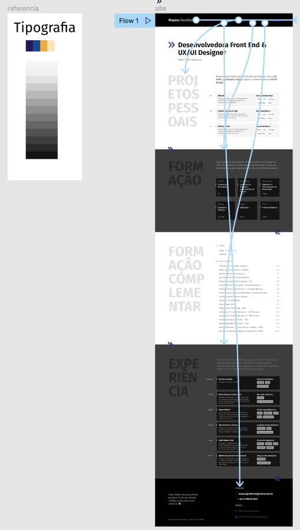

Porfólio pessoal desenvolvido com HTML, CSS e JavaScript durante o curso de Desenvolvimento Web da Origamid.

> ### [Projeto/Protótipo realizados no Figma](https://www.figma.com/file/GCc15pxS2QawO6IoBgxcOK/mayara-projeto-pessoal-uma-pagina?node-id=10%3A0)

<div style="text-align: center">
  
</div>

<div style="text-align: center">
  
</div>

> Terminal (Windows) + VS Code:
```sh 
$ cd "diretorio-pessoal"
```
```sh 
$ git clone https://github.com/mayaragualberto/mayaragualberto.github.io.git
```
```sh 
$ code mayaragualberto.github.io.git
```

> VS Code:
```sh 
abrir index.html
```

> Extensão Live Server:

```sh 
alt+L, alt+O
```
